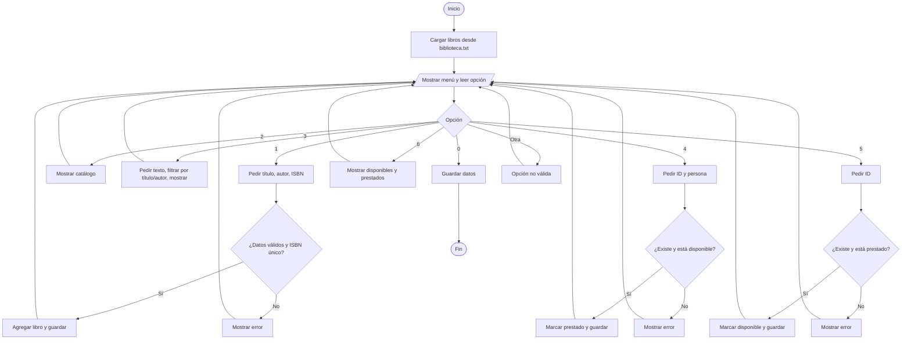

# Diagrama de flujo general

```mermaid
flowchart TD
    A([Inicio]) --> B[Cargar libros desde biblioteca.txt]
    B --> C[/Mostrar menú y leer opción/]
    C --> D{Opción}
    D -->|1| E[Pedir título, autor, ISBN] --> E2{¿Datos válidos y ISBN único?}
    E2 -->|Sí| E3[Agregar libro y guardar] --> C
    E2 -->|No| E4[Mostrar error] --> C
    D -->|2| F[Mostrar catálogo] --> C
    D -->|3| G[Pedir texto, filtrar por título/autor, mostrar] --> C
    D -->|4| H[Pedir ID y persona] --> H2{¿Existe y está disponible?}
    H2 -->|Sí| H3[Marcar prestado y guardar] --> C
    H2 -->|No| H4[Mostrar error] --> C
    D -->|5| I[Pedir ID] --> I2{¿Existe y está prestado?}
    I2 -->|Sí| I3[Marcar disponible y guardar] --> C
    I2 -->|No| I4[Mostrar error] --> C
    D -->|6| J[Mostrar disponibles y prestados] --> C
    D -->|0| K[Guardar datos] --> L([Fin])
    D -->|Otra| M[Opción no válida] --> C
```
Pegue el código en https://mermaid.live para exportarlo como imagen (PNG/SVG) para el entregable.
